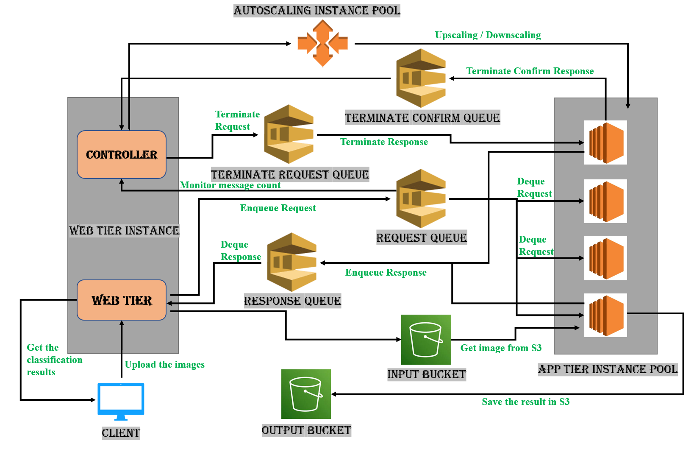
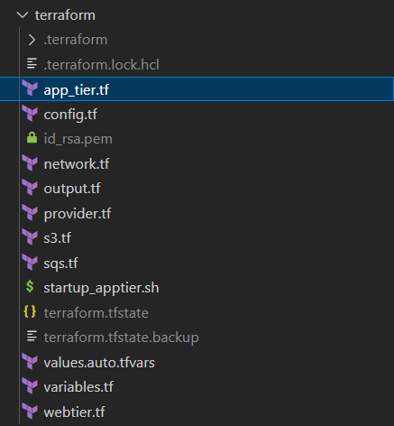
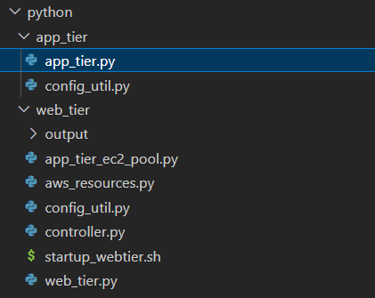

## Problem Statement

Applications deployed on local or isolated servers are prone to scalability issues. We will need to manually scale the application servers as the service's demand rises. This raises the service's overall hardware and operational costs. Extra servers will be needed in the event of a sudden increase in demand for an internet-based service, and this cannot be set up quickly.

Nearly all scalable apps are now deployed in the cloud in this era of computing. Cloud computing service providers like Amazon Web Services, Microsoft Azure, Google Cloud Platform, and others offer a variety of solutions including load balancing and auto scaling to address the aforementioned challenges. With the push of a button or by keeping an eye on various matrices available for the services we run, these cloud services enable us to instantly deploy more servers that can handle the new demands.

In this project, we aim to set up an image recognition system that can manage several requests concurrently in the AWS cloud. The number of application servers will be scaled up in response to a sudden increase in requests to ensure that all client requests are processed promptly. When demand is low, the service also aims to decrease the number of instances down to a minimum. This aids in lowering the service's operating expenses.

This project will show how to use cloud computing's capabilities to lower operational costs and manual efforts to successfully run an internet-based service.

## Architecture

### Web Tier Instance
The Web Tier Instance is an AWS EC2 instance that runs 2 programs: (i) a Python Flask web server that receives user image requests and returns the result as a response containing the classification result, and (ii) a Python controller that keeps track of running app tier instances and a creates/destroys app tier instances. When a user uploads an image to the web server, the image is stored in an AWS S3 bucket i.e. the Input Bucket. The Web Server then enques the classification request containing the image file name and a unique request id to an AWS SQS Queue i.e. the Request Queue. 
The controller program is implemented as an infinite loop that polls the Request Queue every 10 seconds. It creates and terminates app tier EC2 instances based on the number of requests and also keeps track of the number of running instances by assigning each instance a unique id. The autoscaling logic is explained in detail in section 2.2. The web server then polls the Response Queue, deletes the message, and returns the response to the user.

### SQS Queues
This project uses 4 different AWS SQS queues namely the (i) Request Queue, (ii) Response Queue, (iii) Terminate Request Queue and (iv) Terminate Confirm Queue. 
The web_tier adds user requests to the Request Queue. These requests are read and deleted after processing by the App Tier instances. Once an app tier instance has completed classification of a particular request, it stores the result along with the request id in the Response Queue. The controller then reads and deletes this response from the queue.
If the number of requests in the queue is less than the number of running app tier instances, the controller sends instance termination requests to the Terminate Request Queue to terminate idle instances. In case more requests come in, the controller cancels termination requests by deleting messages from the  Terminate Request Queue. Once an app tier instance is done processing a request, it polls this queue for termination requests. If it finds such a request, it consumes and deletes this message and sends a termination confirmation message along with its instance id to the Terminate Confirm Queue. The controller reads this message and then terminates the app tier  instance using its instance id.

### S3 Buckets
This project uses two AWS S3 buckets namely the (i) Input Bucket and (ii) Output Bucket. When the web server receives an image from the user, it stores this image in the Input Bucket. An app tier instance reads an image from the Input Bucket and saves it locally on the VM. After the deep learning model has classified this image, the app tier instance then stores this key-value pair i.e. the filename and the classification result to the Output Bucket.

### App Tier Instance Pool
The controller maintains a pool of EC2 instances, i.e. App Tier instances. Each instance is assigned an app tier id by the controller. Upon creation, a Python program is run on the app tier instance with the app tier id as an argument. This program is implemented as an infinite loop in which each iteration is run every 5 seconds. In each iteration, the app tier program first polls the Request Queue for messages. It then takes the image file name from the request and then passes it to the deep learning model on the same instance for classification. The classification result is sent to the Response Queue along with the request id and then request is deleted from the Request Queue. The program then polls the Terminate Request Queue for termination requests. If it finds such a request, it deletes the message from the queue and sends a termination confirmation message to the Terminate Confirm Queue along with its instance identifier.

## AutoScaling
Autoscaling, sometimes also called automatic scaling, is a method used in cloud computing that dynamically adjusts the number of computational resources in a server farm - typically measured by the number of active servers - automatically based on the load on the farm. AWS Auto Scaling is a service that assists organizations in supervising AWS-based software and infrastructure. The service automatically adjusts capacity to maintain steady, predictable performance at the lowest possible cost.  Using AWS Auto Scaling, you maintain optimal application performance and availability, even when workloads are periodic, unpredictable, or continuously changing. The overall benefit of auto scaling is that it eliminates the need to respond manually in real-time to traffic spikes that merit new resources and instances by automatically changing the active number of servers.

The benefits of auto-scaling include-
1) Better fault tolerance: Auto-scaling helps in determining and detecting which of the instances present on the server is unhealthy. Once established, the unhealthy instance is quickly terminated, and another healthy instance is sent as a replacement for the unhealthy one.
2) Better availability: Auto-scaling helps in ensuring that the application has the right amount of capacity for handling the current traffic demand
3) Better cost management: Auto-scaling can dynamically increase and decrease the capacity as required. With auto-scaling, one can launch instances when needed and also terminate these when they are not required.
 
In this project we have two queues associated with auto scaling. One of them is Terminate Request Queue and the other is Terminate Confirm Queue. 
 
The controller continuously monitors the Request Queue and when the size of the queue increases than the number of instances, the controller notifies the instance pool to launch new instances by calculating the count of the instances that need to be launched. If the instance pool has an App Tier Id to be assigned, an instance gets created. The instance is created using an AMI that contains the classifier file which does the image recognition and the app_tier file. Once the instance is up and running, it starts to poll messages from the Request Queue.
 
When the messages in the Request Queue decrease, the controller enqueues messages in the Terminate Request Queue. The app_tier instances look for messages in the Terminate Request Queue after each classification task is completed and before polling for new request messages from the Request Queue. If the instance finds a message in the Terminate Request Queue, it initiates the termination process where it deletes the request message from Terminate Request Queue and pushes a request containing its instance ID to Terminate Confirm Queue where the App Tier instance is terminated.
 
In this process where the controller pushes messages in the Terminate Request Queue for some instances to get terminated, if new messages arrive in the request queue, the controller deletes the messages from the Terminate Request Queue based on the number of more instances that are required.
 
Autoscaling working with the help of an Example:
 
Suppose the user decides to upload 110 images in the request queue. The controller monitors the Request Queue and gets the total message count (which includes the pending messages which are unprocessed and the inflight messages). It gets the count of the total active instances from the app tier instance pool. The active instances count is the difference between the number of instances running and the number of instances that have initiated the termination request. The maximum number of instances for the instance pool is 20, then for 110 requests enqueued, 20 instances get launched at the start.
 
Each instance then starts polling from the request queue. The image is downloaded in the app tier instance from the input S3 Bucket and is used to do the classification. The output of the classifier is then sent to the output S3 bucket and the Response Queue. Each instance when launched pops an Id from the available tier Ids and when terminating, pushes the App Tier Id back into the collection set. The app tier instance needs to delete the message after reading from the Request Queue else the message becomes visible again in the queue. The deletion is done using the receipt handle of the message which acts as a unique identifier for each message.
 
The 20 instances will keep on polling messages from the Request Queue. Once the request decreases in the queue, the controller starts to initiate a termination request in the Terminate Request Queue. Say the number of active instances is 20 and the queue size has become 18, then the controller will send two requests in the Terminate Request Queue. Of the 20 instances which are running, the first two instances of App Tier that complete the image classification pick the messages from the Terminate Request Queue and start the termination process by sending its instance Id to the Terminate Confirm Queue. The controller polls this message and then terminates the instance of the app tier.
 
Meanwhile, if new user requests come in the Request Queue while some termination requests are already initiated in the Terminate Request Queue, then the controller deletes the messages from the Terminate Request Queue to avoid terminating the running instances instead of launching new ones. For instance, say the total active instances are 10 and the Terminate Request Queue has 5 messages. Now if 3 more requests come, then 3 messages are deleted from the Terminate Request Queue by the controller. In this case, only 2 app tier instances will be terminated. But if 7 new messages come in the Request Queue, then all the 5 messages will be deleted from the Terminate Request Queue and 2 more instances launched by the controller. When all the request messages are consumed from the Request queue, the last instance of the app tier is also terminated.

## Testing and evaluation
To carry out testing, we initially started with uploading a single image to the web tier. After receiving a success response, we tried increasing the load for the web tier and observed autoscaling of the app tier. When the request message count is greater than 20, the total active instance count of app tier count becomes 20. We tested with a total of 150 input messages in the input queue and observed that the entire process of autoscaling to the instance termination of all the instances took around 8 minutes. As the image classification is done instantly, we introduced a slight delay after each process of classifying the image. We also tested the application uploading the images in batches where the new instance gets launched when the total message count in the request queue is less than 20. We also tested a scenario where some termination requests were initiated by the controller and new messages added into the request queue. We observed the requests being deleted by the controller from the Terminate Request Queue. After testing the application with a significant amount of test cases, the application was ready for submission and demonstration.

## Code Explanation
The codebase for this project consists of two components. The first part is infrastructure as a code (IaaC), which handles the deployment of the infrastructure used for running the application. The application code, which handles the processing of user requests, makes up the second component.

### Infrastructure as a Code (IaaC)
The infrastructure required for the project is deployed in the amazon web services cloud using the open-source tool called Terraform. The configuration of the infrastructure is provided using a configuration language called the Hashicorp Configuration Language(HCL). Terraform helps to automate the deployment and management of resources in the cloud along with state management of the resources.

The terraform directory in the project contains all the terraform code required for the deployment of the infrastructure in AWS. The functions of each files in the directory is explained below:

### File: app_tier.tf
This file deploys the ec2 instance for the app tier, and then copy all the required application tier code to the created ec2 instance. It also installs the dependencies and finally a new Amazon Machine Image(AMI) is created based on this new instance.

### File: config.tf
For the proper execution of the application code, certain configuration data like the SQS URL, S3 bucket names, etc have to be copied into the created instances. This file makes sure that these configuration files are created properly. It also adds the SSH key to AWS key pairs, which helps the user log in to the instances if required.

### File: network.tf
This file creates and configures the networking needs of the application. This file creates the VPC, subnets, security groups, and its rules and makes sure network connection to the internet is ensured using internet gateways and route table associations. 

### File: output.tf
This file is used to define all the outputs we need to display once the terraform deployment succeeds. This can be details like the IP of the newly created instances, URL of the SQS queus, or id of the AWS resource created. This is displayed in the client system from where the deployment is initiated. 

### File: provider.tf
This file defines the providers for terraform to use. It can also be used to pass the credentials to log in to the AWS account for the deployments. A better way to pass the credentials is Environment variables.

### File: s3.tf
This file deploys the input and output S3 buckets in the infrastructure.

### File: sqs.tf
This file deploys the four SQS queues shown in the architecture diagram. 

### File: startup_apptier.sh
This is the shell script that is run in the application tier instance when its created. This script installs the dependencies required for the services running in the application tier. 

### File: values.auto.tfvars
This file is used to pass values to the variables created in the terraform code. Any data that might require a change in the future depending on environments or the client system can be added to this file. This includes data like the public key of the SSH key, storage account names, etc. 

### File: variables.tf
This file has the declaration of all the variables used in this terraform code. It also has default values for the variables created and their data types. 

### File: webtier.tf
This file deploys the ec2 instance required for the web tier of the application. It also does the required initial configuration for the services to run on this server. And finally, it starts the services in the web tier. 

## Application Code

### Web Tier

The web tier instance consists of the web_tier and controller and the instance pool python files as shown above. When the Web Tier EC2 instance is launched by Terraform, it installs the required packages like flask, pyyaml, boto3 and runs the controller and web tier python files. The Web Tier instance listens on port 3000 for user data.

Code Description:

*save_img_to_bucket()* ⇒ Saves the input image to the Bucket

*send_img_request_to_sqs()* ⇒ Saves the input image data to Request Queue

*get_S3_Client()* ⇒ Get the S3 Resource in the the given region

*get_SQS_Client()* ⇒ Get the SQS Resource in the given region. It sends JSON data in the body.

*Controller file* : Monitors the Request Queue and Upscales/Downscales the App Tier instances.

*get_Request_Queue_Size()* ⇒ Get the Request Queue Resource size

*get_config_data()* ⇒ Reads the configuration data from the file created by the terraform. This file contains all the information about the resources like SQS and Bucket URLs, AMI name etc.

*poll_response_queue()* ⇒ It monitors the Response Queue and consumes messages from it.

*cancel_Request_In_Shudown_Queue()* ⇒ It cancels requests in the Queue based on the count provided. This is used to prevent shutdown of running instances when new requests come in the Request Queue.

*launch_instances()* ⇒ Launch new instances based on the count provided

*send_Request_to_Shutdown_Queue()* ⇒ Send request to Terminate Request Queue based on the count provided

*terminate_EC2_Instances()* ⇒ Initiates the process of terminating the App Tier instance when the message count in the Request queue is less.

*create_ec2_instance()* ⇒ Creates a new instance of EC2 based on the parameters

### App Tier

The App Tier instance consists of the Classifier and the App Tier python file. It polls for the message in the Request Queue and downloads the image in the local VM in the classifier directory. This downloaded image is fed to the classifier script and the output result is stored in the S3 bucket and response sent to the Response Queue. After classification is done, it polls a message from the Terminate Request Queue. If it is not empty, it consumes the message and initiates the termination process.

Code Description:

*get_S3_Client()* ⇒ Get the S3 Resource in the the given region

*get_SQS_Client()* ⇒ Get the SQS Resource in the given region. It sends JSON data in the body.

*downloadImage()* ⇒ Download the Image from the Input Bucket in given location as parameter

*get_classification_results()* ⇒ Does image recognition using the directory of the input image. It runs the classifier python file.

### Installation Steps
For the deployment of the application in AWS cloud, The only required installation in the local machine of the user is Terraform. The installation instructions for terraform in well explained in their website. 
https://www.terraform.io/downloads
Don’t forget to add terraform executable to the Path variables in Windows. 

### AWS Credentials
 For the tools to communicate with AWS, we requires an AWS IAM account with programmatic access. 
1) Login to AWS account and select IAM from the list of services
2) Select Users from the side panel and click on Add users button
3) After providing an accepted user name, Select AWS credential type as Access key - Programmatic access
4) Set the permissions for the account. Make sure to have enough permissions to deploy resources in the account. Click the next button and add tags if required. 
5) Click the Create User button to get the Access Key and the Secret Key.

### Environment Variables:

AWS credentials are passed to terraform using environment variables. Set the following environment variables with their values as obtained in the previous section, in the local machine terminal for deployment.

*AWS_ACCESS_KEY_ID*

*AWS_SECRET_ACCESS_KEY*

*TF_VAR_aws_access_key_id*

*TF_VAR_aws_secret_key_id*

### TFVARS file
Update the values in the values.auto.tfvars file as required. 
1) ssh_public_key: Provide the public key content as string. This is the public key for connecting to the deployed ec2 instances using SSH.
2) ssh_pem_file_path: Provide the path as a string  to the .pem file of the SSH private key
3) output_bucket_name: Provide  the name of the output s3 bucket
4) input_bucket_name:  Provide  the name of the input s3 bucket

### Deployment

1) Set the current working directory as the terraform folder inside the project directory.
2) Run the command : terraform init
This initializes the terraform dependencies.
3) Run the command : terraform plan
This creates a plan for the deployments in AWS and it will be displayed on the terminal.
4) Run the command : terraform apply
This again creates the plan, and asks for confirmation for deployment. Type in yes in the terminal to start deployment. 
5) Wait till the deployment is completed.

### Clean Up

1) Once the deployment has served its purpose, make sure that the application tier instances have scaled down to zero instances.
2) Run the command inside the terraform directory : terraform destroy
This will destroy all the resources created in AWS cloud for this project.

### Expected Issues

1) If the deployment fails half way with an error message saying that the storage account name is taken, change the storage account names in the values.auto.tfvars file and restart the deployment.
2) If during the creation of ec2 instances, the deployment fails with an error which suggests failure to copy files into the system, double check the ssh_public_key and ssh_pem_file_path given in the values.auto.tfvars file. Make sure the .PEM file has required permissions. 

### References:

https://www.terraform.io/docs

https://boto3.amazonaws.com/v1/documentation/api/latest/index.html

https://flask.palletsprojects.com/en/2.2.x/

# Login Keys:
    Access Key : XXXXXXXXXXXXXXXXXXXX
    Secret key : XXXXXXXXXXXXXXXXXXXX

# AWS Credential
    Root User Id : XXXXXXXXXXXXXXXXXXXX
    Password     : XXXXXXXXXXXXXXXXXXXX

# SQS Queue Names:
    1. request_queue
    2. response_queue
    3. terminate_request_queue
    4. terminate_confirm_queue

# S3 Bucket Names:
    1. pro1input
    2. pro1output

# Need to run below commands in the Terminal
$Env:AWS_ACCESS_KEY_ID          =         XXXXXXXXXXXXXXXXXXXX
$Env:AWS_SECRET_ACCESS_KEY      =         XXXXXXXXXXXXXXXXXXXX
$Env:TF_VAR_aws_access_key_id   =         XXXXXXXXXXXXXXXXXXXX
$Env:TF_VAR_aws_secret_key_id   =         XXXXXXXXXXXXXXXXXXXX

# Steps to run
1) Configure above variables in the environment
2) Run terraform apply -auto-approve
3) Run the Workload generator
4) Validate the response